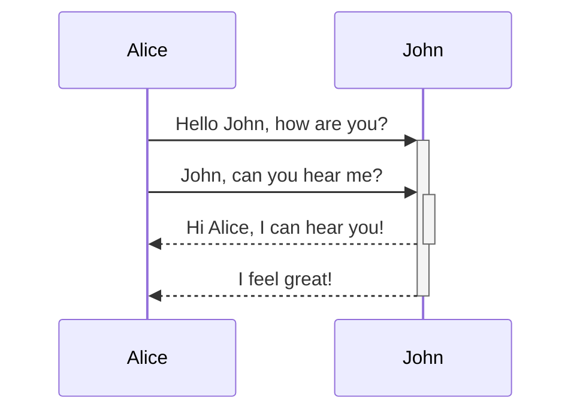

**标题**

```

# This is a heading
## This is a heading
### This is a heading
#### This is a heading
##### This is a heading
###### This is a heading

```

# This is a heading
## This is a heading
### This is a heading
#### This is a heading
##### This is a heading
###### This is a heading

---


**加粗**

```

**This text will be bold**

```

**This text will be bold**

---

**斜体**

```

*This text will be italic*

```

*This text will be italic*

---

**组合：斜体+加粗** 

```

_You **can** combine them_

```

_You **can** combine them_

---

**高亮**

```

Use two equal signs to ==highlight text==.

```

Use two equal signs to ==highlight text==.

---

**删除线**

```

Any word wrapped with two tildes (like ~~this~~) will appear crossed out.

```

Any word wrapped with two tildes (like ~~this~~) will appear crossed out.

---

**引用**

```

> Human beings face ever more complex and urgent problems, and their effectiveness in dealing with these problems is a matter that is critical to the stability and continued progress of society. 

> —— Doug Engelbart, 1961

```

> Human beings face ever more complex and urgent problems, and their effectiveness in dealing with these problems is a matter that is critical to the stability and continued progress of society. 
> —— Doug Engelbart, 1961

---

**任务列表**

```

- [x] #tags, [links](), **formatting** supported 
- [x] list syntax required (any unordered or ordered list supported) 
- [x] this is a complete item
- [ ] this is also a complete item (works with every character) 
- [ ] this is an incomplete item
- [ ] tasks can be clicked in Preview to be checked off

```

- [x] [links](), **formatting** supported 
- [x] List syntax required (any unordered or ordered list supported) 
- [x] This is a complete item
- [ ] This is also a complete item (works with every character) 
- [ ] This is an incomplete item
- [ ] Tasks can be clicked in Preview to be checked off

---

**表格**

```

|First Header | Second Header|
|------------ | -----‐------|
|Content from cell 1 | Content from cell 2|
|Content in the first column | Content in the second column|

```

| First Header                | Second Header                |
| --------------------------- | ---------------------------- |
| Content from cell 1         | Content from cell 2          |
| Content in the first column | Content in the second column |

---

**脚注**

```

Here's a simple footnote,[^1] and here's a longer one.[^bignote]

[^1]: meaningful!
[^bignote]: Here's one with multiple paragraphs and code. 

```

Here's a simple footnote,[^1] and here's a longer one.[^bignote]

[^1]: meaningful!
[^bignote]: Here's one with multiple paragraphs and code. 

---

**注释**

```

Here is some inline comments: %%You can't see this text%% (Can't see it in Reading mode) 

Here is a block comment: 

%%
It can span multiple lines
%%

```

Here is some inline comments: %%You can't see this text%% (Can't see it in Reading mode) 

Here is a block comment: 

%%
It can span multiple lines
%%

---

**[[Callouts Style]]**

```

> [!INFO] 
> Here's a callout block. 
> It supports **markdown** and [[Callouts style|wikilinks]].

```

> [!INFO] 
> Here's a callout block. 
> It supports **markdown** and [[Callouts Style|wikilinks]].

---

**代码块**

```

```js
function fancyAlert(arg) { 
	if(arg) {
		$.facebox({div:'#foo'}) 
	}
} 

```

```js

function fancyAlert(arg) { 
	if(arg) {
		$.facebox({div:'#foo'}) 
	}
} 

```


---

**行内代码**

```

Text inside `backticks` on a line will be formatted like code.

```

Text inside `backticks` on a line will be formatted like code.

---

**无序列表**

```

- Item 1 
- Item 2
	- Item 2a
	- Item 2b

```

- Item 1 
- Item 2
	- Item 2 a
	- Item 2 b

---

**有序列表**

```

1. Item 1 
2. Item 2
	1. Item 3 
	2. Item 3a
	3. Item 3b

```

1. Item 1 
2. Item 2
	1. Item 3 
	2. Item 3 a
	3. Item 3 b

---

**图片**

```


```


---

**链接**

```

http://obsidian.md - automatic! [Obsidian](http://obsidian.md)

```

http://obsidian.md - automatic! [Obsidian](http://obsidian.md)

---

**Diagram**

Obsidian uses [Mermaid](https://mermaid-js.github.io/) to render diagrams and charts . Mermaid also provides [a helpful live editor](https://mermaid-js.github.io/mermaid-live-editor).

```

	```mermaid
	sequenceDiagram
		Alice->>+John: Hello John, how are you?
		Alice->>+John: John, can you hear me?
		John-->>-Alice: Hi Alice, I can hear you!
		John-->>-Alice: I feel great! 
	```
```





---

